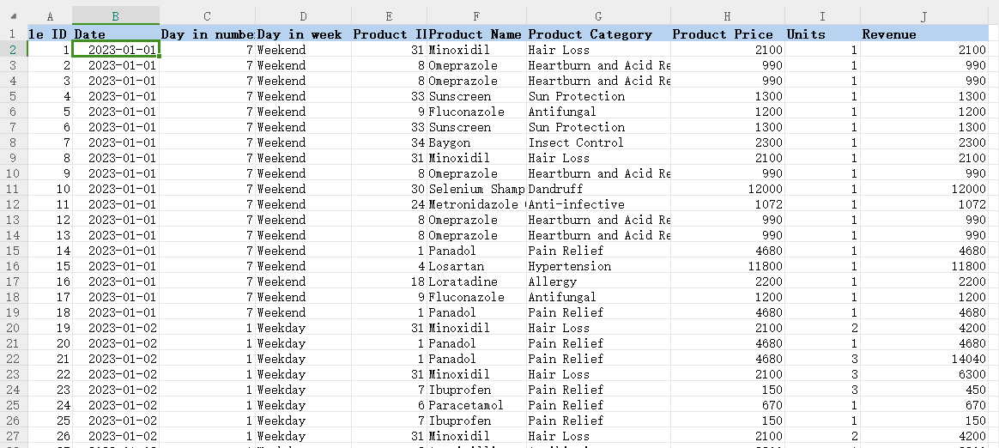
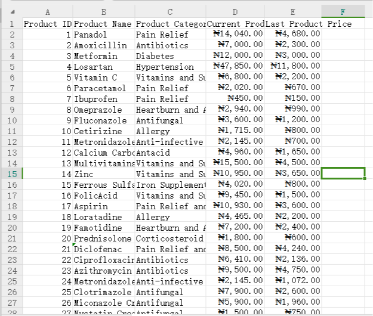
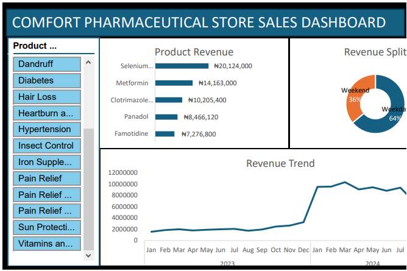

# Comfort Pharmaceutical Store Sales Analysis

## Introduction:
I received a raw dataset from Comfort Pharmaceutical Store to provide sales insight in their data, which must be delivered within 3 days. To meet the deadline, I decided to work overnight after my 9-to-5 job.

## Problem Statements:
1. Which products generated most revenue?
2. When are sales made, weekdays or weekends?
3. Which months are most sales made?

## Data Cleaning:
After inspecting the data, which contained approximately 15,000 daily sales entries from 2023 to 2024, I cleaned and added the necessary columns for successful data transformation.

## Exploratory Data Analysis:
Day 2 was spent in performing exploratory data analysis to get summarised information using the pivot tables. I made the table for the revenues generated during weekday and weekend. Secondly the revenue generated monthly during the years and thirdly the revenue generated for the top 5 products sold. 
Then I visualized it by building an interactive dashboard in order to see the patterns and trend. Pie chart was used to represent the revenues generated during the weekends and weekdays while the top 5 selling products from the pharmaceutical store was represented using bar chart and finally, monthly revenue was represented using a line chart.

## Results Presentation and Interpretation:
Day 3, results presentation and interpretation was carried out. 
  **Results**: From the dashboard the results showed that more than half of the revenue generated were made during the weekdays (64%) as against weekends which stand at 36%. The revenues generated grew steadily from January to August 2023 then rose with sharp increase from December 2023 through to March 2024, before becoming fairly stable.
The result also showed that the top 5 profitable products were selenium sulfide with N20,124,000 generated, followed by melformin (N14,163,000), clotrimazole cream (N10,205,400), panadol (8,466,120) and lastly famotidine (N7,276,800). 
 **Interpretation**: More sales were made during weekdays which could be as a result of closeness of the store to a market. Also, weekdays have 5 days as against 2 days on weekends.The economic crisis as a result of high inflation which affected prices of goods and services in Nigeria assurely started in November/December 2022 due to poor economic policy of CBN which got out of control as a result of subsidy removal in May 2023 by President Tinubu as revealed by the trend, with the prices of the store products becoming double, triple and even quadruple in some cases.Finally, among the top performing products is melformin which is used in treating type 2 diabetes which means many homes could have been consuming more carbohydrates instead of a balanced diet due to the harsh economic condition of the country, which could as well also be 
the reason many people were consuming panadol to treat their headache (as many people were working extra hours to sustain themselves and their families). As it is becoming difficult for many households to eat 2 or 3 times a day, many could have developed stomach ulcers and as a result brings about the increase in the consumption of famotidine. And as the saying goes "eat your food like your medicine or else you will eat your medicine as food." 

## Conclusion and Recommendation:
Day 4: The job already delivered but it is good to look at my conclusion. 
 **Conclusion**: The increased in revenue generated in naira term does not mean the business was profitable in 2024 than in 2023 because majority of these products were imported into Nigeria and were purchased in dollars. If we compare naira value to a dollar as at April 2023 which stood at N460 per dollar and from May 2024 till now (dollar exchange between N1400 to N1600) which means the pharmaceutical store only barely maintained its revenue generation. 
 **Recommendation**: It would be good if Comfort Pharmaceutical Store can give me access to more data that can show the cost of importing each product inorder not to base this on assumption but fact.
